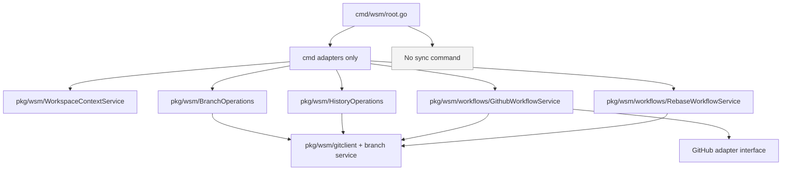
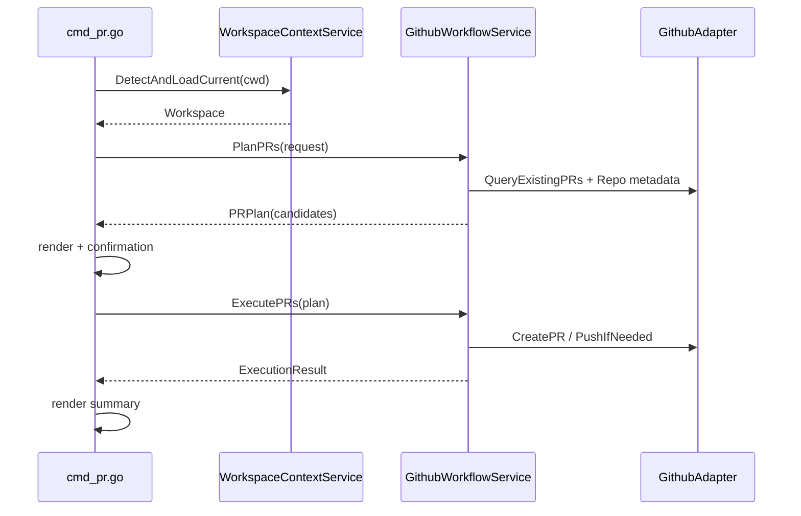

# Command Verb Complexity Audit and pkg Extraction Plan

## Executive Summary

This document proposes a two-part architectural cleanup of the Workspace Manager CLI:

1. Remove `sync` altogether (command surface and sync-specific workflow orchestration).
2. Move command-embedded behavior into reusable, testable `pkg/` APIs so `cmd/` becomes a thin adapter layer.

### Sprint Update (2026-02-28): Hard Removal of 6 Commands + Consolidation

Scope has been expanded from removing only `sync` to hard-removing six commands with no backward compatibility:

- `sync`
- `conflicts`
- `tmux`
- `starship`
- `pr`
- `push`

Consolidation objective for this sprint:

- reduce CLI surface to core workspace lifecycle and git-inspection/coordination commands,
- remove GitHub-specific and shell-environment-specific workflows from WSM command surface,
- keep the architectural direction toward reusable `pkg/` services and thinner `cmd/` adapters.

Consolidation mapping (removed -> retained workflow):

- `sync` -> `status`, `rebase`, `branch`, `commit --push`, direct `git pull/push` as needed.
- `conflicts` -> `rebase status`, `rebase continue`, `rebase abort`, direct `git mergetool` and `git add`.
- `pr` -> direct `gh pr create` outside WSM.
- `push` -> direct `git push` (and optional `gh` checks outside WSM).
- `tmux` -> external tmux workflow/scripts outside WSM.
- `starship` -> external shell prompt setup outside WSM.

This is not a cosmetic cleanup. The current command layer carries significant workflow logic (GitHub checks, local interactive flows, repository scanning heuristics, ad-hoc shell orchestration). That makes behavior harder to reuse, harder to test, and harder for a new engineer to reason about. The target architecture explicitly treats `cmd/` as input/output wiring and `pkg/` as behavior.

For an intern joining the project, the key idea is simple:

- If a behavior changes repository state or makes business decisions, it should live in `pkg/`.
- If a behavior parses flags, prints tables, or asks for confirmation, it should live in `cmd/`.

## Problem Statement

### User-level objective

You requested:

- remove `sync` entirely,
- classify all verbs by complexity,
- identify what functionality still lives in `cmd_*.go`,
- define how to move/merge that functionality into `pkg/`,
- produce a detailed, intern-friendly blueprint.

### Current architectural tension

At the root command layer, all verbs are registered in one place ([cmd/wsm/root.go](/home/manuel/workspaces/2025-08-23/refactor-workspace-manager/workspace-manager/cmd/wsm/root.go#L58)). The command set includes both straightforward delegating commands and highly stateful workflows.

The tension is:

- Some commands already delegate well to reusable services (`create` -> `WorkspaceManager`, `commit` -> `GitOperations`, `status` -> `StatusChecker`).
- Other commands still carry substantial business logic directly inside `cmd/` (`pr`, `push`, `merge`, `rebase`, `tmux`, `starship`).
- `sync` is currently both a user-facing verb and a container for unrelated capabilities (synchronization, branch operations, workspace log retrieval) in `pkg/wsm/sync_operations.go`.

### Why this matters now

If we do not clean this up now:

- command behavior remains hard to reuse from non-CLI contexts,
- testability remains uneven (unit tests hit command code instead of service code),
- future intern onboarding is slower (logic spread across many command files),
- removing `sync` later becomes a larger break because more code will accrete around it.

## Scope

### In scope

- Remove `sync` verb and sync workflow semantics.
- Audit all root verbs and classify by complexity.
- Map command-embedded behavior and define extraction targets in `pkg/`.
- Design future reusable service boundaries and DTOs.
- Provide phased implementation and migration plan.

### Out of scope

- Implementing all refactors in this ticket (this ticket is the analysis/design blueprint).
- Redesigning UX wording of every command.
- Replacing Cobra.

## Current-State Architecture (Evidence-Based)

## Root verb map

Root registration currently includes:

- `discover`, `list`, `create`, `fork`, `merge`, `add`, `remove`, `delete`, `info`, `status`, `pr`, `push`, `commit`, `sync`, `branch`, `rebase`, `diff`, `log`, `conflicts`, `tmux`, `starship`.

Reference: [cmd/wsm/root.go](/home/manuel/workspaces/2025-08-23/refactor-workspace-manager/workspace-manager/cmd/wsm/root.go#L58).

## `sync` and coupling hotspots

The `sync` command (`sync all|pull|push`) is defined in [cmd/cmds/cmd_sync.go](/home/manuel/workspaces/2025-08-23/refactor-workspace-manager/workspace-manager/cmd/cmds/cmd_sync.go#L15) and delegates to `SyncOperations.SyncWorkspace`.

`SyncOperations` currently mixes three domains in one type:

1. synchronization (`SyncWorkspace`, pull/push, ahead/behind),
2. branch orchestration (`CreateBranch`, `SwitchBranch`),
3. history/log retrieval (`GetWorkspaceLog`).

Reference: [pkg/wsm/sync_operations.go](/home/manuel/workspaces/2025-08-23/refactor-workspace-manager/workspace-manager/pkg/wsm/sync_operations.go#L52) and [pkg/wsm/sync_operations.go](/home/manuel/workspaces/2025-08-23/refactor-workspace-manager/workspace-manager/pkg/wsm/sync_operations.go#L239).

This coupling leaks upward:

- `branch` command uses `SyncOperations` for branch create/switch ([cmd/cmds/cmd_branch.go](/home/manuel/workspaces/2025-08-23/refactor-workspace-manager/workspace-manager/cmd/cmds/cmd_branch.go#L83)).
- `log` command also uses `SyncOperations` ([cmd/cmds/cmd_diff.go](/home/manuel/workspaces/2025-08-23/refactor-workspace-manager/workspace-manager/cmd/cmds/cmd_diff.go#L98)).

So removing `sync` command alone is insufficient; we also need to unbundle non-sync features from `SyncOperations`.

## Command-layer functionality currently in `cmd_*.go`

Notable business logic currently in command files:

1. Workspace detection/lookup heuristics and loading:
- `detectWorkspace` and `loadWorkspace` in [cmd/cmds/cmd_status.go](/home/manuel/workspaces/2025-08-23/refactor-workspace-manager/workspace-manager/cmd/cmds/cmd_status.go#L88).
- `detectCurrentWorkspace` in [cmd/cmds/cmd_commit.go](/home/manuel/workspaces/2025-08-23/refactor-workspace-manager/workspace-manager/cmd/cmds/cmd_commit.go#L116).

2. GitHub workflow decision logic:
- PR candidate filtering and branch/PR checks in [cmd/cmds/cmd_pr.go](/home/manuel/workspaces/2025-08-23/refactor-workspace-manager/workspace-manager/cmd/cmds/cmd_pr.go#L216).
- Push candidate filtering, remote repo checks, and commit counting in [cmd/cmds/cmd_push.go](/home/manuel/workspaces/2025-08-23/refactor-workspace-manager/workspace-manager/cmd/cmds/cmd_push.go#L197).

3. Rebase orchestration (parallel fan-out, status/continue/abort workflow, table rendering):
- [cmd/cmds/cmd_rebase.go](/home/manuel/workspaces/2025-08-23/refactor-workspace-manager/workspace-manager/cmd/cmds/cmd_rebase.go#L93).

4. Merge orchestration and rollback behavior:
- [cmd/cmds/cmd_merge.go](/home/manuel/workspaces/2025-08-23/refactor-workspace-manager/workspace-manager/cmd/cmds/cmd_merge.go#L82).

5. Tmux session management and tmux config execution:
- [cmd/cmds/cmd_tmux.go](/home/manuel/workspaces/2025-08-23/refactor-workspace-manager/workspace-manager/cmd/cmds/cmd_tmux.go#L54).

6. Starship config generation and filesystem writes:
- [cmd/cmds/cmd_starship.go](/home/manuel/workspaces/2025-08-23/refactor-workspace-manager/workspace-manager/cmd/cmds/cmd_starship.go#L56).

## Verb Complexity Classification

### Classification rubric

- `Low`: primarily delegation + formatting; little branching logic; low side-effect diversity.
- `Medium`: workflow branching, mild orchestration, or interactive prompts; moderate side effects.
- `High`: multi-step orchestration, external tool integration (`git`/`gh`/`tmux`), retry/fallback/conflict handling, or parallel fan-out.

### Verb matrix

| Verb | File | LoC | Complexity | Why |
|---|---|---:|---|---|
| discover | `cmd_discover.go` | 109 | Low | Mostly delegates to repository discoverer |
| list | `cmd_list.go` | 217 | Medium | Sorting/filtering + rendering, mostly data read |
| create | `cmd_create.go` | 244 | Medium | Interactive selection + branch naming + preview logic |
| fork | `cmd_fork.go` | 198 | Medium | Branch consistency checks + workspace derivation |
| merge | `cmd_merge.go` | 471 | High | Multi-step merge workflow + rollback + validations |
| add | `cmd_add.go` | 59 | Low | Simple command wrapper |
| remove | `cmd_remove.go` | 59 | Low | Simple command wrapper |
| delete | `cmd_delete.go` | 157 | Medium | Confirmation + status preview + destructive behavior |
| info | `cmd_info.go` | 144 | Low | Read-only retrieval and display |
| status | `cmd_status.go` | 393 | High | Complex workspace detection heuristics + formatting |
| pr | `cmd_pr.go` | 391 | High | GitHub workflow decisions + interactive execution |
| push | `cmd_push.go` | 381 | High | Remote validation + candidate analysis + interactive execution |
| commit | `cmd_commit.go` | 198 | Medium | Delegates commit core, but keeps interactive selection and workspace detection |
| sync | `cmd_sync.go` | 262 | Medium | Wrapper orchestration over sync service (to be removed) |
| branch | `cmd_branch.go` | 221 | Medium | Delegates business logic but tied to `SyncOperations` result model |
| rebase | `cmd_rebase.go` | 636 | High | Largest orchestration surface, subcommands, concurrency, manual mode |
| diff | `cmd_diff.go` | 127 | Low | Thin wrapper over `GitOperations` |
| log | `cmd_diff.go` | 127 | Medium | Thin logic, but coupled through `SyncOperations` |
| conflicts | `cmd_conflicts.go` | 131 | Medium | Parallel fan-out + conflict workflows |
| tmux | `cmd_tmux.go` | 264 | High | Session lifecycle + config execution + process replacement |
| starship | `cmd_starship.go` | 197 | Medium | Config generation + filesystem mutation + confirmation |

## Complexity implications for intern onboarding

When onboarding a new intern, these are the first three practical traps:

1. Naming trap: `SyncOperations` sounds like one concern, but currently hosts multiple concerns.
2. Boundary trap: commands with business logic can look like thin wrappers at first glance.
3. Tooling trap: many commands shell out to external tools and hide policy in ad-hoc helper functions.

Our redesign should eliminate these traps by making service boundaries explicit and semantically named.

## Gap Analysis Against Target Goal

Target goal: all actual functionality should be reusable via `pkg/`, with `cmd/` as adapters.

Current gaps:

1. Reusable workspace resolution is missing as a first-class pkg service.
2. Reusable GitHub workflow service is missing (`pr` and `push` logic in cmd layer).
3. Rebase orchestration service exists partially (`pkg/wsm/rebase_operations.go` primitives), but command-level orchestration dominates.
4. `SyncOperations` mixes synchronization with branch and history functions, creating coupling and naming confusion.
5. Cross-command shared functions (`detectWorkspace`, `loadWorkspace`, `detectCurrentWorkspace`) are duplicated in command files rather than reusable package utilities.

## Proposed Solution

## Design principles

1. Keep command files thin: parse/validate flags, call service, render output.
2. Keep orchestration in `pkg/` services using typed requests/results.
3. Keep external adapters explicit (`git`, `gh`, `tmux`) behind interfaces where behavior/policy matters.
4. Keep domain naming honest (`BranchOperations`, `HistoryOperations`, `WorkspaceResolver`, `GithubWorkflowService`) rather than overloaded names.

## Proposed package evolution

### 1) Remove sync surface

- Remove `sync` command registration and file.
- Remove sync-specific DTOs and workflow methods.
- Retain branch and history behavior by moving them to correctly named services.

### 2) Split `SyncOperations` into focused services

Proposed:

```go
// pkg/wsm/branch_operations.go
type BranchOperations struct {
    workspace *Workspace
}

type BranchOperationResult struct {
    Repository string
    Success    bool
    Error      string
}

func (bo *BranchOperations) CreateBranch(ctx context.Context, branch string, track bool) ([]BranchOperationResult, error)
func (bo *BranchOperations) SwitchBranch(ctx context.Context, branch string) ([]BranchOperationResult, error)
```

```go
// pkg/wsm/history_operations.go
type HistoryOperations struct {
    workspace *Workspace
}

func (ho *HistoryOperations) GetWorkspaceLog(ctx context.Context, since string, oneline bool, limit int) (map[string]string, error)
```

### 3) Introduce reusable workspace context service

```go
// pkg/wsm/workspace_context.go
type WorkspaceContextService interface {
    DetectByCWD(ctx context.Context, cwd string) (workspaceName string, err error)
    LoadByName(ctx context.Context, name string) (*Workspace, error)
    DetectAndLoadCurrent(ctx context.Context, cwd string) (*Workspace, error)
}
```

This replaces command-local `detectWorkspace/loadWorkspace/detectCurrentWorkspace` patterns.

### 4) Introduce use-case services for heavy command workflows

```go
// pkg/wsm/workflows/github.go
type PRPlanRequest struct {
    WorkspaceName string
    DryRun        bool
    Force         bool
    Draft         bool
    Title         string
    Body          string
}

type PushPlanRequest struct {
    WorkspaceName string
    RemoteName    string
    DryRun        bool
    Force         bool
    SetUpstream   bool
}

type GithubWorkflowService interface {
    PlanPRs(ctx context.Context, req PRPlanRequest) (*PRPlan, error)
    ExecutePRs(ctx context.Context, plan *PRPlan) (*PRExecutionResult, error)

    PlanPushes(ctx context.Context, req PushPlanRequest) (*PushPlan, error)
    ExecutePushes(ctx context.Context, plan *PushPlan) (*PushExecutionResult, error)
}
```

```go
// pkg/wsm/workflows/rebase.go
type RebaseWorkflowService interface {
    Plan(ctx context.Context, req RebasePlanRequest) (*RebasePlan, error)
    Execute(ctx context.Context, req RebaseExecuteRequest) (*RebaseExecutionResult, error)
    Status(ctx context.Context, req RebaseStatusRequest) (*RebaseStatusResult, error)
    Continue(ctx context.Context, req RebaseActionRequest) (*RebaseActionResult, error)
    Abort(ctx context.Context, req RebaseActionRequest) (*RebaseActionResult, error)
}
```

### 5) Keep `cmd/` focused on I/O only

Expected command pattern after refactor:

```go
func runVerb(ctx context.Context, flags VerbFlags) error {
    svc := workflows.NewVerbService(...)

    plan, err := svc.Plan(ctx, flags.ToRequest())
    if err != nil { return err }

    if flags.DryRun {
        return render.Plan(plan)
    }

    if flags.Interactive {
        approved, err := prompt.Confirm(plan)
        if err != nil || !approved { return err }
    }

    result, err := svc.Execute(ctx, plan)
    if err != nil { return err }
    return render.Result(result)
}
```

## API Reference (Target)

## Branch and history API

```go
package wsm

type BranchOperationResult struct {
    Repository string
    Success    bool
    Error      string
}

type BranchOperations interface {
    CreateBranch(ctx context.Context, branch string, track bool) ([]BranchOperationResult, error)
    SwitchBranch(ctx context.Context, branch string) ([]BranchOperationResult, error)
}

type HistoryOperations interface {
    GetWorkspaceLog(ctx context.Context, since string, oneline bool, limit int) (map[string]string, error)
}
```

## Workspace context API

```go
package wsm

type WorkspaceContextService interface {
    DetectByCWD(ctx context.Context, cwd string) (string, error)
    LoadByName(ctx context.Context, name string) (*Workspace, error)
    DetectAndLoadCurrent(ctx context.Context, cwd string) (*Workspace, error)
}
```

## GitHub workflow API

```go
package workflows

type CandidateStatus string

const (
    CandidateReady      CandidateStatus = "ready"
    CandidateNeedsPush  CandidateStatus = "needs-push"
    CandidateHasPR      CandidateStatus = "has-pr"
    CandidateNotEligible CandidateStatus = "not-eligible"
)

type PRCandidate struct {
    Repository   string
    Branch       string
    Status       CandidateStatus
    ExistingPR   string
    CommitsAhead int
}
```

## Diagrams

## Current structure (simplified)

```mermaid
flowchart TD
    ROOT[cmd/wsm/root.go] --> C1[cmd/cmds/cmd_sync.go]
    ROOT --> C2[cmd/cmds/cmd_branch.go]
    ROOT --> C3[cmd/cmds/cmd_diff.go(log)]
    ROOT --> C4[cmd/cmds/cmd_pr.go]
    ROOT --> C5[cmd/cmds/cmd_push.go]
    ROOT --> C6[cmd/cmds/cmd_rebase.go]

    C1 --> S1[pkg/wsm/SyncOperations]
    C2 --> S1
    C3 --> S1

    C4 --> ST[pkg/wsm/StatusChecker]
    C4 --> GH1[exec gh + git in cmd]

    C5 --> ST
    C5 --> GH2[exec gh + git in cmd]

    C6 --> RB[pkg/wsm/rebase_operations.go]
    C6 --> GIT3[exec git + orchestration in cmd]
```

## Target structure (simplified)



## Sequence sketch: `pr` after refactor



## Implementation Plan (Phased)

## Phase 1: Remove sync command (thin cut)

1. Remove `cmds.NewSyncCommand()` from root registration.
2. Delete `cmd/cmds/cmd_sync.go`.
3. Update CLI docs/help strings removing sync references.
4. Run compile + targeted tests.

Pseudo-steps:

```bash
# compile guard
rg -n "NewSyncCommand|\bsync\b" cmd/wsm cmd/cmds README.md IMPLEMENTATION.md

go test ./cmd/...
go test ./pkg/wsm/...
```

## Phase 2: Decouple `SyncOperations` responsibilities

1. Create `branch_operations.go` for create/switch branch workflows.
2. Create `history_operations.go` for cross-repo log retrieval.
3. Update branch and log command paths to new services.
4. Remove sync-specific methods and DTOs from `sync_operations.go`.

## Phase 3: Extract heavy command workflows into pkg

1. Introduce `WorkspaceContextService` and migrate detection/loading code.
2. Extract `pr` workflow planning/execution into `GithubWorkflowService`.
3. Extract `push` workflow planning/execution into same service or sibling `PushWorkflowService`.
4. Extract rebase workflow orchestration into `RebaseWorkflowService`.
5. Keep command files as adapters.

## Phase 4: Hardening

1. Add unit tests per new service.
2. Add contract tests for adapter boundaries.
3. Run full suite and track unrelated existing blockers separately.

## Design Decisions

1. **Remove sync as a product concept**, not just a command alias.
Rationale: command semantics are ambiguous; pull/push/rebase/branch are better expressed as explicit verbs.

2. **Split by capability, not by historical file ownership.**
Rationale: `SyncOperations` currently violates single responsibility.

3. **Promote workspace detection/loading into pkg service.**
Rationale: repeated command-local logic is a maintenance hotspot.

4. **Introduce typed workflow request/result DTOs for heavy commands.**
Rationale: makes behavior testable and reusable outside CLI.

5. **Keep interactive UI behavior in command adapters.**
Rationale: preserve user interaction concerns at CLI boundary.

## Alternatives Considered

1. Keep `sync` but de-emphasize in docs.
Rejected: keeps confusing semantics and preserves dead-weight code paths.

2. Only delete `cmd_sync.go`, keep `SyncOperations` name and non-sync methods.
Rejected: naming debt and conceptual coupling remain.

3. Move all logic at once into one mega `WorkflowService`.
Rejected: too large, high-risk refactor, hard to review.

4. Keep command-local detection and only extract GitHub workflows.
Rejected: leaves duplicated cross-command infrastructure.

## Risks and Mitigations

1. **Risk:** breaking existing scripts that invoke `wsm sync`.
Mitigation:
- explicit migration note,
- clear error/help text in release notes,
- (optional) temporary command alias that exits with migration guidance.

2. **Risk:** branch/log command regressions during `SyncOperations` split.
Mitigation:
- extract one concern at a time,
- keep DTO shape stable initially,
- add focused tests before deleting old paths.

3. **Risk:** over-engineering service layers.
Mitigation:
- start from concrete command extraction,
- avoid abstraction without immediate call-site needs,
- keep interfaces minimal.

## Intern Implementation Walkthrough

If you are new to the codebase, start in this order:

1. Read root command registration: [cmd/wsm/root.go](/home/manuel/workspaces/2025-08-23/refactor-workspace-manager/workspace-manager/cmd/wsm/root.go#L58).
2. Read `sync` command and service: [cmd/cmds/cmd_sync.go](/home/manuel/workspaces/2025-08-23/refactor-workspace-manager/workspace-manager/cmd/cmds/cmd_sync.go#L15), [pkg/wsm/sync_operations.go](/home/manuel/workspaces/2025-08-23/refactor-workspace-manager/workspace-manager/pkg/wsm/sync_operations.go#L52).
3. Read where non-sync commands depend on sync service:
- [cmd/cmds/cmd_branch.go](/home/manuel/workspaces/2025-08-23/refactor-workspace-manager/workspace-manager/cmd/cmds/cmd_branch.go#L83)
- [cmd/cmds/cmd_diff.go](/home/manuel/workspaces/2025-08-23/refactor-workspace-manager/workspace-manager/cmd/cmds/cmd_diff.go#L98)
4. Read high-complexity command workflows:
- [cmd/cmds/cmd_rebase.go](/home/manuel/workspaces/2025-08-23/refactor-workspace-manager/workspace-manager/cmd/cmds/cmd_rebase.go#L93)
- [cmd/cmds/cmd_merge.go](/home/manuel/workspaces/2025-08-23/refactor-workspace-manager/workspace-manager/cmd/cmds/cmd_merge.go#L82)
- [cmd/cmds/cmd_pr.go](/home/manuel/workspaces/2025-08-23/refactor-workspace-manager/workspace-manager/cmd/cmds/cmd_pr.go#L83)
- [cmd/cmds/cmd_push.go](/home/manuel/workspaces/2025-08-23/refactor-workspace-manager/workspace-manager/cmd/cmds/cmd_push.go#L81)

Then implement Phase 1 (remove sync) first. Keep that change set focused and green before beginning API extraction.

## Open Questions

1. Do we want a temporary user-facing compatibility shim for `wsm sync` that prints migration guidance, or a hard removal immediately?
2. Should `tmux` and `starship` remain in this binary long-term, or move to optional integration plugins?
3. Should GitHub integration live behind a dedicated adapter package (`pkg/wsm/github`) to isolate `gh` CLI dependency?
4. Is `log` conceptually a `history` command that should be surfaced separately from `diff` command file placement?

## References

1. Root command registration: [cmd/wsm/root.go](/home/manuel/workspaces/2025-08-23/refactor-workspace-manager/workspace-manager/cmd/wsm/root.go#L58)
2. Sync command: [cmd/cmds/cmd_sync.go](/home/manuel/workspaces/2025-08-23/refactor-workspace-manager/workspace-manager/cmd/cmds/cmd_sync.go#L15)
3. Sync operations: [pkg/wsm/sync_operations.go](/home/manuel/workspaces/2025-08-23/refactor-workspace-manager/workspace-manager/pkg/wsm/sync_operations.go#L52)
4. Branch command dependence on sync ops: [cmd/cmds/cmd_branch.go](/home/manuel/workspaces/2025-08-23/refactor-workspace-manager/workspace-manager/cmd/cmds/cmd_branch.go#L83)
5. Log command dependence on sync ops: [cmd/cmds/cmd_diff.go](/home/manuel/workspaces/2025-08-23/refactor-workspace-manager/workspace-manager/cmd/cmds/cmd_diff.go#L98)
6. Status command detection logic: [cmd/cmds/cmd_status.go](/home/manuel/workspaces/2025-08-23/refactor-workspace-manager/workspace-manager/cmd/cmds/cmd_status.go#L88)
7. Command-local current workspace detection: [cmd/cmds/cmd_commit.go](/home/manuel/workspaces/2025-08-23/refactor-workspace-manager/workspace-manager/cmd/cmds/cmd_commit.go#L116)
8. PR workflow in command layer: [cmd/cmds/cmd_pr.go](/home/manuel/workspaces/2025-08-23/refactor-workspace-manager/workspace-manager/cmd/cmds/cmd_pr.go#L83)
9. Push workflow in command layer: [cmd/cmds/cmd_push.go](/home/manuel/workspaces/2025-08-23/refactor-workspace-manager/workspace-manager/cmd/cmds/cmd_push.go#L81)
10. Rebase command orchestration: [cmd/cmds/cmd_rebase.go](/home/manuel/workspaces/2025-08-23/refactor-workspace-manager/workspace-manager/cmd/cmds/cmd_rebase.go#L93)
11. Tmux orchestration in command layer: [cmd/cmds/cmd_tmux.go](/home/manuel/workspaces/2025-08-23/refactor-workspace-manager/workspace-manager/cmd/cmds/cmd_tmux.go#L54)
12. Merge orchestration in command layer: [cmd/cmds/cmd_merge.go](/home/manuel/workspaces/2025-08-23/refactor-workspace-manager/workspace-manager/cmd/cmds/cmd_merge.go#L82)
